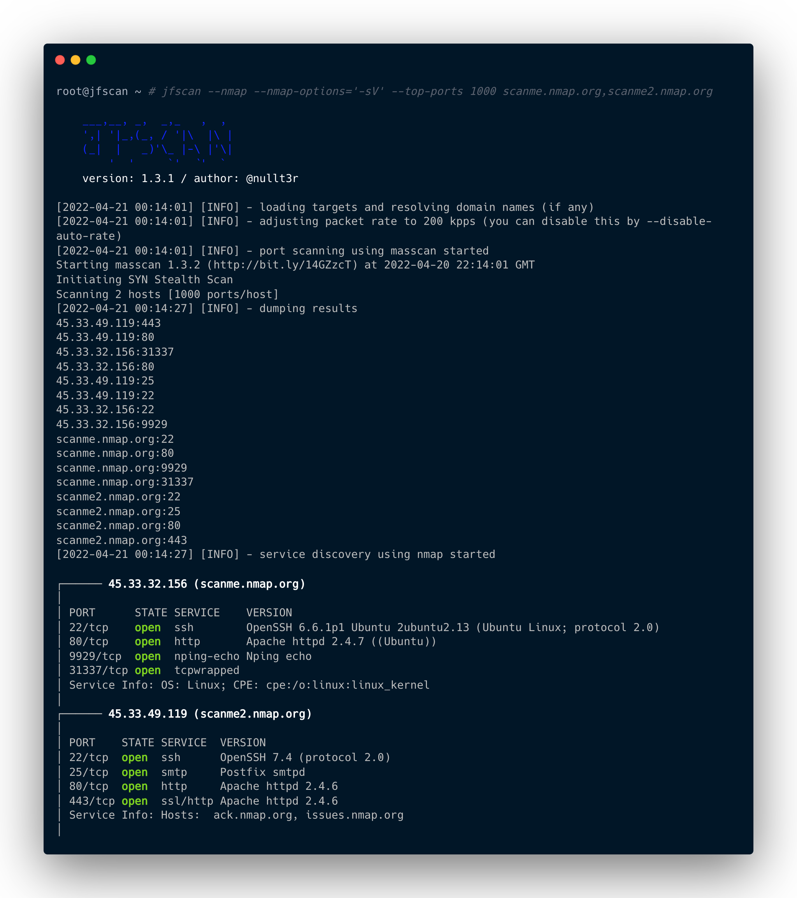
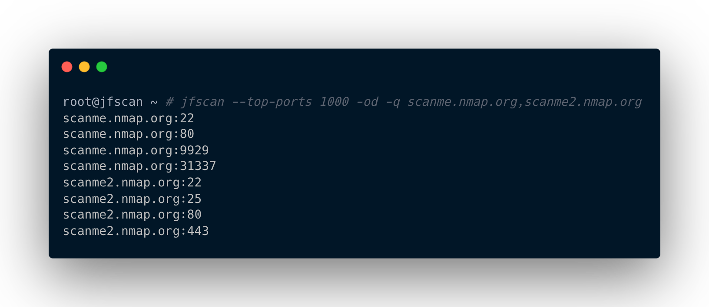
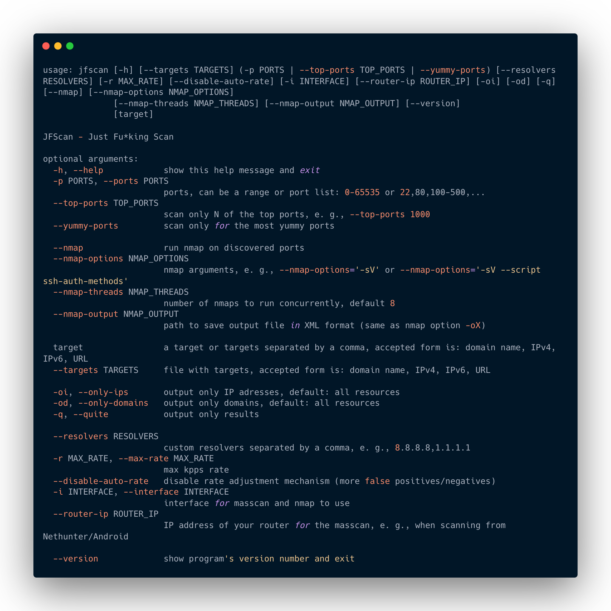

  
# Description
## Killing features
* Perform a large-scale scans using Nmap! Allows you to use Masscan to scan targets and execute Nmap on detected ports with custom settings. Nmap on steroids. *
* Scans targets in variety of formats, including domain names!
* Results can be produced in domain:port format.
* It works in stdin/stdout mode, allowing you to stream results to/from other tools.
* Auto-adjusts a packet rate for masscan so you don't have to (disable it by --disable-auto-rate).
* Produces a standard Nmap XML report.

The JFScan (Just Fu*king Scan) is a wrapper around a super-fast port scanner Masscan. It's designed to simplify work when scanning for open ports on targets in a variety of formats. The JFScan accepts a target in the following forms: URL, domain, or IP (including CIDR). You can specify a file with targets using argument or use stdin.

The JFScan also allows you to output only the results and chain it with other tools like Nuclei. The domain:port output of JFScan is crucial if you want to discover vulnerabilities in web applications as the virtual host decides which content will be served.

Finally, it can scan discovered ports with Nmap. You can also define custom options and use Nmap's amazing scripting capabilities.





JFScans logic of input & output processing:


# Usage


Please follow installation instructions before running. Do not run the JFScan under a root, it's not needed since we set a special permissions on the masscan binary.

## Example
Scan targets for only for ports 80 and 443 with rate of 10 kpps:

`$ jfscan -p 80,443 --targets targets.txt -r 10000`

Scan targets for top 1000 ports :

`$ jfscan --top-ports 1000 1.1.1.1/24`

You can also specify targets on stdin and pipe it to nuclei:

`$ cat targets.txt | jfscan --top-ports 1000 -q | httpx -silent | nuclei`

Or as positional parameter:

`$ jfscan --top-ports 1000 1.1.1.1/24 -q | httpx -silent | nuclei`

Or everything at once, the JFScan just does not care and scans all the targets specified:

`$ echo target1 | jfscan --top-ports 1000 target2 --targets targets.txt -q | httpx -silent | nuclei`

Utilize nmap to gather more info about discovered services:

`$ cat targets.txt | jfscan -p 0-65535 --nmap --nmap-options="-sV --scripts ssh-auth-methods"`

The targets.txt can contain targets in the following forms:
```
http://domain.com/
domain.com
1.2.3.4
1.2.3.0/24
```

# Installation
1. Before installation, make sure you have the latest version of Masscan installed (tested version is 1.3.2).

First, install a libpcap-dev (Debian based distro) or libcap-devel (Centos based distro):

```
sudo apt install libpcap-dev
```

Next, clone the official repository and install:
```
sudo apt-get --assume-yes install git make gcc
git clone https://github.com/robertdavidgraham/masscan
cd masscan
make
sudo make install
```


1. The Masscan requires root permissions to run. Since running binaries under root is not good idea, we will set a CAP_NET_RAW capability to the binary:

```
sudo setcap CAP_NET_RAW+ep /usr/bin/masscan
```

3. For installation of JFscan a python3 and pip3 is required.

```
sudo apt install python3 python3-pip
```

4. Install JFScan:
```
$ git clone https://github.com/nullt3r/jfscan.git
$ cd jfscan
$ pip3 install .
```
If you can't run the jfscan directly from command line you should check if $HOME/.local/bin is in your path.

Add the following line to your `~/.zshrc` or `~/.bashrc`:

```
export PATH="$HOME/.local/bin:$PATH"
```

# License
Read file LICENSE.

# Disclaimer
I am not responsible for any damages. You are responsible for your own
actions. Attacking targets without prior mutual consent is illegal.
___

\* *When scanning smaller network ranges, you can just use nmap directly, there is no need to use JFScan. You can reach up to 70% of the speed of JFScan using the following options:*
```
nmap -Pn -n -v yourTargetNetwork/26 -p- --min-parallelism 64 --min-rate 20000 --min-hostgroup 64 --randomize-hosts -sS -sV
```
*As always, expect some false positivies/negatives.*